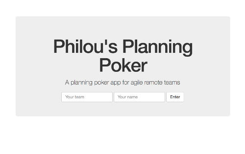
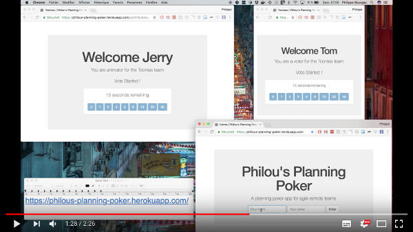

# Planning-Poker


[](https://codeclimate.com/github/philou/planning-poker)
[](https://codeclimate.com/github/philou/planning-poker/coverage)
[](https://codeclimate.com/github/philou/planning-poker) [](https://philous-planning-poker.herokuapp.com/)

Effective [Planning Poker](https://en.wikipedia.org/wiki/Planning_poker) sessions for remote teams.

[](https://philous-planning-poker.herokuapp.com/)

## Vision

Running effective Planning Poker sessions is a challenge for agile remote teams. Without a special setup, they would use a video conference to share their estimates through the camera. With this app, a phone call is enough.

In the long run, it could improve the estimation experience for both remote and co-located teams :

* It could warn of a "risky" or "unlikely" estimations, by analyzing the distribution
* It help to do "Risk" estimations, which have 2 axes (likelihood and criticality)

## How to use it

More usage details can be found on the [project's homepage](http://philippe.bourgau.net/planning-poker). Here is a video.

[](https://www.youtube.com/watch?v=yUTpabukwxE)

## How to run it

### Heroku

The app is continuously deployed to [Heroku](https://www.heroku.com) at https://philous-planning-poker.herokuapp.com/.

Deploying to your own Heroku app is straightforward. It only requires an SQL DB and a Redis server. Here is the way to go :

```bash
# install the Heroku command line
brew install heroku

# clone the repo
git clone git@github.com:philou/planning-poker.git
cd planning-poker

# create an Heroku app
heroku apps:create

# add a Postgres DB
heroku addons:create heroku-postgresql:hobby-dev

# add Redis
heroku addons:create heroku-redis:hobby-dev

# deploy
git push heroku master

# migrate your database
heroku run rake db:migrate
```

Your app should be running in the cloud !

### Local machine

Deploying on a local machine or server is pretty simple too. 

#### Pre-requisite

You need to have a few things installed first :

* [Ruby](https://www.ruby-lang.org), I use [rbenv](https://github.com/rbenv/rbenv) for that
* [Docker](https://www.docker.com/)
* [PhantomJS](http://phantomjs.org/) if you want to run the tests

#### Sources

Then, clone the repo :

```
git clone https://github.com/philou/planning-poker.git
cd planning-poker
```

#### Dependencies

They are managed with bundler. Just run the following :

```
bundle install
```

bundle might complain that some dependencies are missing on your OS, in this case follow its advices and install them.

#### Database

There is a docker compose configuration to start services dependencies. You can either use docker, or start these services yourself. Here is the docker way.

You'll need to have docker and docker compose installed :

* https://docs.docker.com/engine/installation/
* https://docs.docker.com/compose/install/

Then, run the following to create the database :

```
docker-compose up
bundle exec rake db:create
bundle exec rake db:migrate
```

#### Local run

The db should be started from previous step. Start the rails server the typical way

```
bundle exec bin/rails server
```

Check that it's running at http://localhost:3000

## How to contribute

### Issues

Issues and user stories are maintained in the [github issues](https://github.com/philou/planning-poker/issues) of this repo. [ZenHub](https://www.zenhub.com/) is a nice addition to visualize and prioritize the tasks to work on.

### Continuous Delivery Chain

There is a [TravisCI Job](https://travis-ci.org/philou/planning-poker) continuously building any change on the github repo. When the build passes, the app is automatically deployed to [Heroku](https://philous-planning-poker.herokuapp.com/).

The repo is also linked to a [Code Climate project](https://codeclimate.com/github/philou/planning-poker) which performs static code analysis and monitors code issues.

### Coding Conventions

Here are the few guidelines I followed when building the initial version of this app

* Stick to the standards : Code Climate is very good at pointing out any infringement to this rule
* Do the simplest thing that could work. I did not build complex stuff when more down to earth solutions work perfectly in the current setting
* Update the dependencies as often as possible. As the whole code is automatically tested, it's a lot easier to stay on the latest versions.
* Test Driven Development is key in allowing Continuous Delivery
* As few mocks as possible. Mocks are brittle, difficult to maintain and provide a false sense of security
* I tracked technical debt (the things I decided not to do now) using #TODO comments, which appear in Code Climate